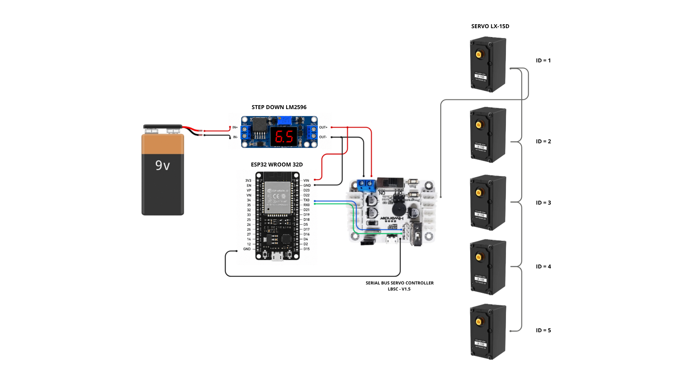

# 🦾Novo Braço Robótico - STEM CRIAR

O Novo Braço Robótico – STEM CRIAR é um projeto desenvolvido no âmbito do projeto STEM CRIAR. Este repositório reúne os códigos-fonte, bibliotecas, configurações e demais arquivos utilizados no desenvolvimento e controle do braço robótico.

## 💻Programação

Toda programação foi desenvolvida em C++ utilizando a plataforma **Visual Studio Code** juntamente com a extensão **PlatformIO (3.3.4)**. O projeto foi criado utilizando servos inteligentes da **Hiwonder** que contam driver, motor e circuito de controle de barramento. Os usuários podem enviar comandos específicos ao servomotor — com base no protocolo de comunicação fornecido pela nossa empresa — para controlar a rotação, ler informações do dispositivo ou alternar para o modo de motor de passo. Cada servomotor possui três interfaces, permitindo a conexão em cascata.

Link com mais informações sobre os servos inteligentes: https://drive.google.com/drive/folders/1yaZ8iRYgWncdHPopioo7OYuHoGhrMxCi?hl=pt-br  
Manual de configuração dos servos LX-15D também se encontra em: [eletronica](eletronica/LX_15D_Bus_Servo_User_Manual.pdf)

## ⚡Eletrônica

### 📍Componentes utilizados: 
- Servos LX-15D
- Serial Bus Servo Controller LBSC - V1.5
- ESP32 WROOM 32Dem
- Regulador de Tensão LM2596 ajustável com display
- Bateria 9v

### 📍Diagrama Elétrico 

Link sobre informações da placa Serial Bus Servo Controller LBSC - V1.5 e configurar os ID's dos servos: https://docs.hiwonder.com/projects/Bus-Servo-Controller/en/latest/docs/1.Bus_Servo_Controller_User_Manual.html

## ⚠️Observações:
- A tensão de operação dos Servos LX-15D está entre 6v - 8.4v. Valores menores impediram o funcionamento e valores maiores danificaram o componente.
- O ESP32 não controla os servos diretamente; ele se comunica com a placa Serial Bus Servo Controller por meio de uma interface serial UART. Portanto, a interface UART utilizada para a comunicação com a placa **não deve ser compartilhada com o Monitor Serial**, sendo recomendável utilizar interfaces seriais distintas para cada finalidade.
- Os Servos só funcionaram se estiverem pré-definidos com o seus ID's.
- Ao configurar os IDs dos servos utilizando o software da HiWonder, é possível que, em algumas placas controladoras, a porta de comunicação não seja identificada como uma porta COM no Windows, mas apareça no Gerenciador de Dispositivos como um dispositivo na categoria Human Interface Devices (HID). Isso ocorre porque, nesse caso, a comunicação com a placa é estabelecida por meio da **interface Wire**. Para verificar se a conexão foi reconhecida corretamente, basta consultar o status de “Wire Connect” no software da HiWonder.
